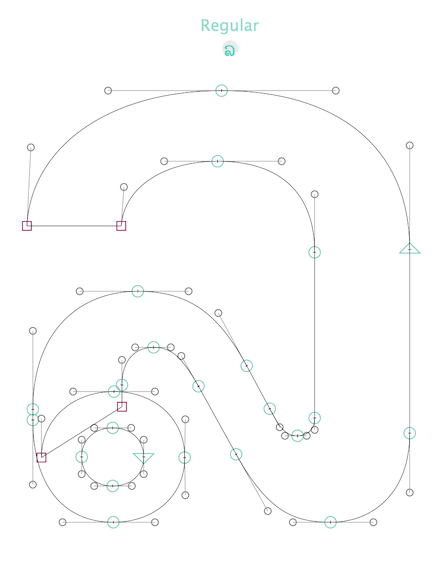

# Python-scripts-for-Glyphs

##Show master name and glyph:

21/02/16 This plugin shows the name of the current master in the Edit view, above the top of the glyph's bounding box. Handy for situations where masters are so close in weight that edits can unwittingly be made to the wrong master. The plugin also shows a small representation of the current glyph, handy to keep in view for unfamiliar scripts as the background image disappears as soon as paths are drawn.

##Place anchors in all masters

This little Python script will add _top anchors to all selected (mark) glyphs at the coordinates specified in each master listed. Adapt anchor names, coordinates and master names as required.

22/10/15 This version rewritten by @mekkablue, thanks Erich!

##Zero width

This one is to zero the width of all layers of selected glyphs (use for nonspacing marks). Though Glyphs does set all mark glyphs to zero width on export, it's often useful to have them zeroed from the start, so they can be designed with correct size and position relative to the base glyphs. This script quickly zeroes the width of all layers to save you time clicking through each separately and manually zeroing widths.
